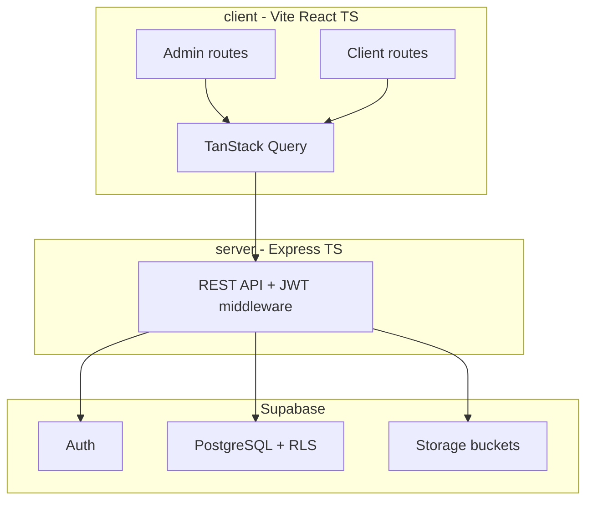

# ClientSpace — Implementation Plan

> Technical planning document for building **ClientSpace**, the client portal MVP.
>
> **Product spec:** [CLIENT_PORTAL_MVP.md](./CLIENT_PORTAL_MVP.md) — source of truth for features, scope, and portfolio narrative.
>
> **Decisions captured here (not in MVP):**
> - **TypeScript** on frontend and backend (MVP spec is language-agnostic)
> - **Combined planning doc** — tech stack, API contract, and task list live in this single file

---

## MVP analysis summary

[CLIENT_PORTAL_MVP.md](./CLIENT_PORTAL_MVP.md) defines **ClientSpace**: a dual-role client portal (admin freelancer/agency + client customer) with project/task management, file sharing, and comments. The repo is **greenfield** — only the spec exists today; no application code or config yet.

### Strengths of the spec

- Clear role separation (admin vs client) with explicit RLS requirement
- Well-defined data model (6 tables, FK relationships, soft-delete patterns)
- Scoped Phase 1 vs Phase 2 (AI scope generation is additive, no schema change)
- Concrete routes, build order, and portfolio narrative
- Explicit portfolio proof points (multi-role auth, REST API layer, not client-only Supabase queries)

### Gaps resolved in this plan

| Gap in MVP | Resolution |
|---|---|
| No language specified | **TypeScript** on frontend + backend |
| No folder layout | `client/` (Vite React) + `server/` (Express) at repo root |
| No API contract | REST endpoints documented below |
| Auth flow detail | Supabase Auth for both roles; Express validates JWT on every protected route |
| Admin bootstrap | Seed first admin via Supabase dashboard or migration script |
| Activity feed | Derive from `tasks.updated_at`, `comments.created_at`, `files.created_at` (no separate `activity` table) |

---

## Architecture



**Key principle:** The frontend calls the **Express REST API** for all data operations. It does not query Supabase Postgres directly. The only Supabase usage on the client is **Auth** (login, session, JWT). Express verifies the JWT on every protected route and performs DB/Storage operations via Supabase (service role or user-scoped client). This satisfies the portfolio goal of a real authenticated API layer.

---

## Tech stack

| Area | Choice | Notes |
|---|---|---|
| Language | TypeScript 5.x | Shared types in `shared/` or duplicated DTOs |
| Frontend | React 18 + Vite | SPA, no SSR |
| Routing | React Router v6 | Admin and client route trees |
| Styling | Tailwind CSS | Optional: shadcn/ui for faster polish |
| Data fetching | TanStack Query v5 | Per-resource hooks, optimistic task reorder |
| Forms | React Hook Form + Zod | Client/project/task forms |
| Backend | Node 20 + Express 4 | `cors`, `helmet`, `express-async-errors` |
| DB | Supabase PostgreSQL | SQL migrations in `supabase/migrations/` |
| Auth | Supabase Auth | Email/password + magic link; `role` in `users` table |
| Storage | Supabase Storage | Bucket `project-files`, path `{projectId}/{uuid}-{filename}` |
| API auth | JWT via `Authorization: Bearer` | Middleware verifies via Supabase `getUser(jwt)` |
| Env | `.env.example` in `client/` and `server/` | See [Local setup](#local-setup) |
| Deploy | Netlify (frontend) + Railway or Render (API) | Separate env per environment |
| Dev tooling | ESLint, Prettier, concurrent dev script | `npm run dev` runs both apps |

### Portfolio stack tags

React · TypeScript · Node.js · PostgreSQL · Supabase · OpenAI API (Phase 2)

---

## Folder structure

```
client.io/
├── CLIENT_PORTAL_MVP.md      # Product spec (features, scope)
├── CLIENT_PORTAL_PLAN.md     # This file (tech + tasks)
├── package.json              # Root scripts (concurrently / workspaces)
├── client/                   # Vite + React + TypeScript
│   ├── .env.example
│   ├── src/
│   │   ├── components/
│   │   ├── hooks/
│   │   ├── layouts/          # AdminLayout, ClientLayout
│   │   ├── lib/              # api client, supabase auth client
│   │   ├── pages/            # admin + client pages
│   │   ├── routes/
│   │   └── types/
│   └── ...
├── server/                   # Express + TypeScript
│   ├── .env.example
│   ├── src/
│   │   ├── middleware/       # auth, role guards, error handler
│   │   ├── routes/           # REST route handlers
│   │   ├── services/         # Supabase DB/storage helpers
│   │   ├── types/
│   │   └── index.ts
│   └── ...
├── shared/                   # Optional: shared TypeScript types
│   └── types.ts
└── supabase/
    ├── config.toml
    └── migrations/
```

---

## Data model

Tables and columns from [CLIENT_PORTAL_MVP.md](./CLIENT_PORTAL_MVP.md), plus implementation details.

### Tables

```
users
  id          UUID PK (matches auth.users.id)
  email       TEXT NOT NULL UNIQUE
  role        TEXT NOT NULL CHECK (role IN ('admin', 'client'))
  name        TEXT NOT NULL
  created_at  TIMESTAMPTZ DEFAULT now()

clients
  id          UUID PK DEFAULT gen_random_uuid()
  name        TEXT NOT NULL
  company     TEXT
  email       TEXT NOT NULL
  user_id     UUID FK → users.id
  active      BOOLEAN DEFAULT true
  created_at  TIMESTAMPTZ DEFAULT now()

projects
  id          UUID PK DEFAULT gen_random_uuid()
  title       TEXT NOT NULL
  description TEXT
  client_id   UUID FK → clients.id
  status      TEXT CHECK (status IN ('Planning', 'In Progress', 'Review', 'Done'))
  start_date  DATE
  target_date DATE
  archived    BOOLEAN DEFAULT false
  created_at  TIMESTAMPTZ DEFAULT now()

tasks
  id          UUID PK DEFAULT gen_random_uuid()
  project_id  UUID FK → projects.id
  title       TEXT NOT NULL
  description TEXT
  status      TEXT CHECK (status IN ('To Do', 'In Progress', 'Done'))
  due_date    DATE
  sort_order  INTEGER NOT NULL DEFAULT 0
  created_at  TIMESTAMPTZ DEFAULT now()
  updated_at  TIMESTAMPTZ DEFAULT now()

comments
  id          UUID PK DEFAULT gen_random_uuid()
  task_id     UUID FK → tasks.id
  user_id     UUID FK → users.id
  body        TEXT NOT NULL
  created_at  TIMESTAMPTZ DEFAULT now()

files
  id          UUID PK DEFAULT gen_random_uuid()
  project_id  UUID FK → projects.id
  name        TEXT NOT NULL
  size_bytes  BIGINT NOT NULL
  storage_path TEXT NOT NULL
  uploaded_by UUID FK → users.id
  created_at  TIMESTAMPTZ DEFAULT now()
```

### Indexes

| Table | Index | Purpose |
|---|---|---|
| `clients` | `user_id` | Lookup client by auth user |
| `projects` | `client_id` | List projects per client |
| `projects` | `archived` | Filter active projects |
| `tasks` | `project_id, sort_order` | Ordered task lists |
| `tasks` | `due_date` | Dashboard due/overdue queries |
| `comments` | `task_id, created_at` | Task comment threads |
| `files` | `project_id, created_at` | Project file lists |

### RLS policy summary

All tables have RLS enabled. Policies enforce:

| Role | Access |
|---|---|
| **Admin** | Full read/write on all rows (`users.role = 'admin'`) |
| **Client** | Read only own `clients` row (via `user_id = auth.uid()`) |
| **Client** | Read `projects` where `client_id` matches their client row |
| **Client** | Read `tasks`, `comments`, `files` only for accessible projects |
| **Client** | Insert `comments` on tasks in their projects |
| **Client** | No write access to clients, projects, tasks, or files |

**Alternative:** Route all writes through Express with the service role key and enforce authorization in middleware. RLS remains a defense-in-depth layer for any direct DB access.

### Shared TypeScript types

```typescript
type UserRole = 'admin' | 'client';
type ProjectStatus = 'Planning' | 'In Progress' | 'Review' | 'Done';
type TaskStatus = 'To Do' | 'In Progress' | 'Done';
```

---

## REST API reference

Base URL: `http://localhost:3001` (dev) / deployed API URL (prod).

All protected routes require `Authorization: Bearer <supabase_access_token>`.

| Method | Endpoint | Role | Purpose |
|---|---|---|---|
| GET | `/health` | public | Health check |
| GET | `/dashboard/stats` | admin | Active clients, active projects, due this week, overdue |
| GET | `/dashboard/activity` | admin | Last 10 events (task update, file upload, comment) |
| GET | `/clients` | admin | List clients (`?active=true` default) |
| POST | `/clients` | admin | Create client + auth user |
| GET | `/clients/:id` | admin | Client detail + projects |
| PATCH | `/clients/:id` | admin | Update client |
| PATCH | `/clients/:id/deactivate` | admin | Soft delete |
| GET | `/projects` | admin | List projects (`?archived=false` default) |
| POST | `/projects` | admin | Create project |
| GET | `/projects/:id` | admin | Project detail |
| PATCH | `/projects/:id` | admin | Update project |
| PATCH | `/projects/:id/archive` | admin | Archive project |
| GET | `/projects/:id/tasks` | admin | List tasks (ordered by `sort_order`) |
| POST | `/projects/:id/tasks` | admin | Create task |
| PATCH | `/tasks/:id` | admin | Update task (status, title, due date, etc.) |
| PATCH | `/tasks/reorder` | admin | Bulk update `sort_order` |
| GET | `/projects/:id/files` | admin, client | List files |
| POST | `/projects/:id/files` | admin | Upload file (multipart) |
| DELETE | `/files/:id` | admin | Delete file |
| GET | `/tasks/:id/comments` | admin, client | List comments |
| POST | `/tasks/:id/comments` | admin, client | Add comment |
| GET | `/client/dashboard` | client | Projects, upcoming tasks, recent files |
| GET | `/client/projects/:id` | client | Project detail (tasks, files; read + comment) |

### Phase 2 endpoint (not in Phase 1 build)

| Method | Endpoint | Role | Purpose |
|---|---|---|---|
| POST | `/ai/scope` | admin | Generate suggested tasks from project brief via OpenAI |

---

## Auth flows

### Admin login

1. Admin visits `/login`, signs in via Supabase Auth (email/password).
2. Frontend reads session JWT; calls `GET /dashboard/stats` (or similar) with Bearer token.
3. Express middleware verifies JWT → loads `users` row → confirms `role = 'admin'`.
4. Redirect to `/dashboard`. Non-admin users rejected from admin routes.

### Client onboarding

1. Admin creates client via `POST /clients` with name, company, email.
2. Server creates Supabase Auth user (invite or temp password) + `users` row (`role = 'client'`) + `clients` row.
3. Client receives login link; visits `/client/login`.
4. Client signs in (password or magic link).
5. Post-login redirect to `/client/dashboard`.

### Route guards (frontend)

| Guard | Routes | Rule |
|---|---|---|
| `AdminRoute` | `/dashboard`, `/clients/*`, `/projects/*` | Session exists + `role === 'admin'` |
| `ClientRoute` | `/client/dashboard`, `/client/projects/:id` | Session exists + `role === 'client'` |
| `GuestRoute` | `/login`, `/client/login` | Redirect to dashboard if already authenticated |

### Admin bootstrap

Seed the first admin manually:

1. Create user in Supabase Auth dashboard.
2. Insert into `users`: `{ id: <auth.uid>, email, role: 'admin', name }`.
3. Or run a one-time seed migration/script.

---

## Frontend routes

From [CLIENT_PORTAL_MVP.md](./CLIENT_PORTAL_MVP.md), mapped to implementation.

### Admin

| Route | Page |
|---|---|
| `/login` | Admin auth |
| `/dashboard` | Overview stats + activity feed |
| `/clients` | Client list |
| `/clients/new` | Create client |
| `/clients/:id` | Client detail + project list |
| `/projects` | All projects list |
| `/projects/new` | Create project |
| `/projects/:id` | Project detail (tasks, files, comments) |

### Client (separate layout, same app)

| Route | Page |
|---|---|
| `/client/login` | Client auth |
| `/client/dashboard` | Projects + upcoming tasks + recent files |
| `/client/projects/:id` | Project detail (read + comment) |

---

## Local setup

### Prerequisites

- Node.js 20+
- npm (or pnpm)
- [Supabase CLI](https://supabase.com/docs/guides/cli)
- Supabase project (local via `supabase start` or cloud)

### Environment variables

**`server/.env`**

```
PORT=3001
SUPABASE_URL=
SUPABASE_ANON_KEY=
SUPABASE_SERVICE_ROLE_KEY=
CORS_ORIGIN=http://localhost:5173
```

**`client/.env`**

```
VITE_SUPABASE_URL=
VITE_SUPABASE_ANON_KEY=
VITE_API_URL=http://localhost:3001
```

**Phase 2 only (server):**

```
OPENAI_API_KEY=
```

### Dev commands (target)

```bash
# Install dependencies
npm install

# Run Supabase locally (optional)
supabase start

# Apply migrations
supabase db push

# Start client + server concurrently
npm run dev
```

**Expected:** Client on `http://localhost:5173`, API on `http://localhost:3001`, `GET /health` returns 200.

---

## Task list

Phased build checklist. Mark items `- [x]` as completed during implementation.

### Phase 0 — Project scaffolding

- [ ] Init `client/` with Vite + React + TypeScript + Tailwind
- [ ] Init `server/` with Express + TypeScript (`tsx` dev, `tsc` build)
- [ ] Add root `package.json` with workspaces or `concurrently` dev script
- [ ] Create Supabase project; add `supabase/` CLI config
- [ ] Add `.env.example` files in `client/` and `server/`
- [ ] Define shared types (`UserRole`, `ProjectStatus`, `TaskStatus`, table interfaces)

**Done when:** `npm run dev` serves client on `:5173` and API on `:3001` with health check `GET /health`.

---

### Phase 1 — Database & auth

- [ ] Write migration: `users`, `clients`, `projects`, `tasks`, `comments`, `files`
- [ ] Add FK constraints and indexes (`client_id`, `project_id`, `task_id`, `sort_order`)
- [ ] RLS policies: clients read only own data chain (client → projects → tasks/comments/files)
- [ ] RLS: admin full access via `role = 'admin'` check in policies
- [ ] Enable Supabase Auth: email/password + magic link
- [ ] Seed/bootstrap first admin user
- [ ] Express JWT middleware + role guards (`requireAdmin`, `requireClient`)
- [ ] Frontend: Supabase Auth client, session persistence, protected route wrappers
- [ ] Admin login page: `/login`
- [ ] Client login page: `/client/login`
- [ ] Post-login redirect by role

**Done when:** Admin and client can log in; unauthorized API calls return 401; client cannot access admin routes.

---

### Phase 2 — Client CRUD (admin)

- [ ] `GET /clients` — list with active filter
- [ ] `POST /clients` — create client
- [ ] `GET /clients/:id` — detail
- [ ] `PATCH /clients/:id` — update
- [ ] `PATCH /clients/:id/deactivate` — soft delete
- [ ] Admin page: `/clients` — client list
- [ ] Admin page: `/clients/new` — create form
- [ ] Admin page: `/clients/:id` — detail + project list
- [ ] Create flow: Supabase Auth user + `users` + `clients` rows

**Done when:** Admin can create, edit, deactivate clients; deactivated clients hidden from active list.

---

### Phase 3 — Project CRUD

- [ ] `GET /projects` — list (exclude archived by default)
- [ ] `POST /projects` — create
- [ ] `GET /projects/:id` — detail
- [ ] `PATCH /projects/:id` — update
- [ ] `PATCH /projects/:id/archive` — archive
- [ ] Status enum: Planning | In Progress | Review | Done
- [ ] Admin page: `/projects` — project list
- [ ] Admin page: `/projects/new` — create form
- [ ] Admin page: `/projects/:id` — project detail shell
- [ ] Assign project to client; archive toggle

**Done when:** Full project lifecycle works; archived projects excluded from default lists.

---

### Phase 4 — Task management

- [ ] `GET /projects/:id/tasks` — ordered list
- [ ] `POST /projects/:id/tasks` — create task
- [ ] `PATCH /tasks/:id` — update (status, title, description, due date)
- [ ] `PATCH /tasks/reorder` — bulk `sort_order` update
- [ ] Status enum: To Do | In Progress | Done
- [ ] Task list UI on project detail page
- [ ] Add task (inline or modal)
- [ ] Drag-and-drop reorder
- [ ] Optimistic updates via TanStack Query

**Done when:** Tasks CRUD + reorder + status changes persist correctly.

---

### Phase 5 — File sharing

- [ ] Create Supabase Storage bucket `project-files`
- [ ] Storage policies aligned with project access
- [ ] `POST /projects/:id/files` — multipart upload
- [ ] `GET /projects/:id/files` — list with metadata
- [ ] `DELETE /files/:id` — admin delete + storage cleanup
- [ ] Signed download URLs or proxy download endpoint
- [ ] File list UI on project page (name, size, upload date)

**Done when:** Admin uploads; both roles download; admin deletes.

---

### Phase 6 — Comments

- [ ] `GET /tasks/:id/comments` — flat list, newest first
- [ ] `POST /tasks/:id/comments` — create comment
- [ ] Attribute comments (admin name vs client name)
- [ ] Comment form on task (admin project view)
- [ ] Comment form on task (client project view)

**Done when:** Both roles can comment on shared project tasks.

---

### Phase 7 — Admin dashboard

- [ ] `GET /dashboard/stats` — active clients, active projects, tasks due this week, overdue
- [ ] `GET /dashboard/activity` — last 10 events from tasks, comments, files
- [ ] Admin page: `/dashboard` — stat cards
- [ ] Activity feed component
- [ ] Quick links to active projects

**Done when:** Dashboard reflects live data across all projects.

---

### Phase 8 — Client dashboard

- [ ] `GET /client/dashboard` — projects with status chips, upcoming tasks, recent files
- [ ] `GET /client/projects/:id` — project detail for client
- [ ] Client page: `/client/dashboard`
- [ ] Client page: `/client/projects/:id` — read tasks/files, comment
- [ ] Separate `ClientLayout` (simpler nav, no admin links)

**Done when:** Client sees only their data; full read + comment flow works.

---

### Phase 9 — Polish

- [ ] Empty states (no clients, no projects, no tasks)
- [ ] Loading skeletons
- [ ] Error handling (toasts, error boundaries)
- [ ] Responsive layout (mobile-friendly tables/cards)
- [ ] 404 page
- [ ] Unauthorized / forbidden page

**Done when:** App feels production-ready for demo.

---

### Phase 10 — Deploy & portfolio

- [ ] Create Supabase production project; run migrations
- [ ] Deploy API to Railway or Render
- [ ] Deploy frontend to Netlify
- [ ] Configure CORS (`CORS_ORIGIN` = Netlify URL)
- [ ] Set production env vars (Supabase keys, API URL)
- [ ] Configure Supabase Auth redirect URLs for prod domains
- [ ] Smoke test all flows in production
- [ ] Capture screenshots
- [ ] Update portfolio card (copy from [CLIENT_PORTAL_MVP.md](./CLIENT_PORTAL_MVP.md))

**Done when:** Live public URL works end-to-end.

---

### Phase 11 — Phase 2 backlog (not Phase 1)

Documented for future work. Do not implement during Phase 1.

- [ ] `POST /ai/scope` — OpenAI integration
- [ ] "Generate scope" button on project create/detail
- [ ] Review modal: select tasks to import
- [ ] Bulk create tasks from approved suggestions

**Done when:** Admin can generate, review, and import AI-suggested tasks without schema changes.

---

## Out of scope (Phase 1)

From [CLIENT_PORTAL_MVP.md](./CLIENT_PORTAL_MVP.md):

- Invoicing and payment tracking
- Email notifications or in-app alerts
- Team seats (multiple admins)
- Time tracking
- Recurring tasks
- Public-facing status page
- White-labelling / custom domain per client
- Mobile app

---

## What this proves on the portfolio

- Multi-role auth with row-level security (admin vs client, data isolation)
- Relational data model across 6 tables with foreign key constraints
- Full CRUD across clients, projects, tasks
- File upload and storage with access control
- Clean two-sided product with separate layouts and UX flows per role
- React frontend with real async state management (loading, error, optimistic)
- REST API on Node.js with authenticated routes
- Phase 2 AI integration is additive — can be shown as "v1.1" update
